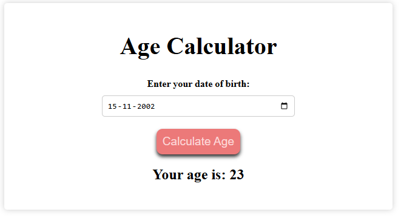

# JavaScript Projects Repository

Welcome to my JavaScript Projects repository! 🎉  
Here, you'll find several JavaScript-based projects showcasing different functionalities and concepts. Below is the list of projects along with their links, descriptions, and screenshots.

You can visit the **[Home Page](https://amanmishra11.github.io/js-2/home.html)** or scroll down to checkout the live demo for the various projects.

---

## 1. Age Calculator
**[Live Demo](https://amanmishra11.github.io/js-2/)**  
A simple tool to calculate your exact age in years, months, and days based on your date of birth.

---

## 2. Dark/Light Mode Toggle
**[Live Demo](https://amanmishra11.github.io/js-2/dark.html)**  
A responsive toggle feature to switch between Dark Mode and Light Mode, enhancing the user experience for different lighting environments.

---

## 3. Products/Cart Management
**[Live Demo](https://amanmishra11.github.io/js-2/products.html)**  
A dynamic product list with cart management functionality, allowing users to add/remove products and adjust quantities.

---

## 4. Keycode Keyboard
**[Live Demo](https://amanmishra11.github.io/js-2/keycode.html)**  
A fun and interactive tool to display the keycode and key value of any key pressed on the keyboard.

---

## 5. Sticky Notes
**[Live Demo](https://amanmishra11.github.io/js-2/sticky.html)**  
A fun and interactive page to add, delete sticky notes with a simple and intuitive interface.

---

## 6. Feedback
**[Live Demo](https://amanmishra11.github.io/js-2/feedback.html)**  
A fun and interactive page to give feedback using emojis.

---

## 7. Digital Clock
**[Live Demo](https://amanmishra11.github.io/js-2/clock.html)**  
A digital clock with options to set the design of the clock and options to set different cities. 

---

## 8. Stopwatch
**[Live Demo](https://amanmishra11.github.io/js-2/stopwatch.html)**  
A stopwatch with start, stop, restart and lap functionalities. 

---

## 9. Burgerking Order
**[Live Demo](https://amanmishra11.github.io/js-2/burgerking.html)**  
A burgerking ordering website which would display when your order is ready with sound effect. 

---

## 10. Leaderboard
**[Live Demo](https://amanmishra11.github.io/js-2/leaderboard.html)**  
A leaderboard page where you can add player details and score to put up in the leaderboard and add or subtract 5 from their points in the leaderboard and their position will change automatically. 

---

## 11. Emoji Search
**[Live Demo](https://amanmishra11.github.io/js-2/emoji.html)**  
An Emoji search page where you can search for emojis and it will display the relevamnt emojis and their description.

---

## 12. Image Search
**[Live Demo](https://amanmishra11.github.io/js-2/image.html)**  
An image search interface built with vanilla JavaScript, featuring Unsplash API integration, local storage for favorites, and a responsive grid layout with neon-cyberpunk aesthetics.

---

## 13. Dad Joke Generator
**[Live Demo](https://amanmishra11.github.io/js-2/dadjoke.html)**  
A web application that delivers dad jokes on-demand with features like favorites, sharing, and theme customization, built with HTML, CSS, and JavaScript, inspired by Google AI's design aesthetics.

---

## 14. Match the Pair
**[Live Demo](https://amanmishra11.github.io/js-2/match.html)**  
An elegant memory matching game with modern UI animations and neon effects.

---

## 15. Find your Pokemon 🌟
**[Live Demo](https://amanmishra11.github.io/js-2/pokemon.html)**  
A cyberpunk-themed Pokémon explorer with neon-styled type filtering and card displays.

---

## 16. Artist Suggester 
**[Live Demo](https://amanmishra11.github.io/js-2/artist.html)**  
A sleek AI-powered music discovery tool that generates personalized artist recommendations based on user preferences using Google's Gemini API, featuring a modern neon-themed UI with split-screen layout.

---

## 17. User Cards
**[Live Demo](https://amanmishra11.github.io/js-2/card.html)**  
A web page hwere any user can put in their details and it will get saved in forms of card, and on clicking the cards with their respective names the card will flip and display all the details.

---

## 18. Movie Search Machine 
**[Live Demo](https://amanmishra11.github.io/js-2/movie.html)**  
MovieFlix is a punk-themed movie search application featuring real-time debounced search, dynamic movie details, and a sleek  UI with neon accents, powered by the OMDB API.

---

